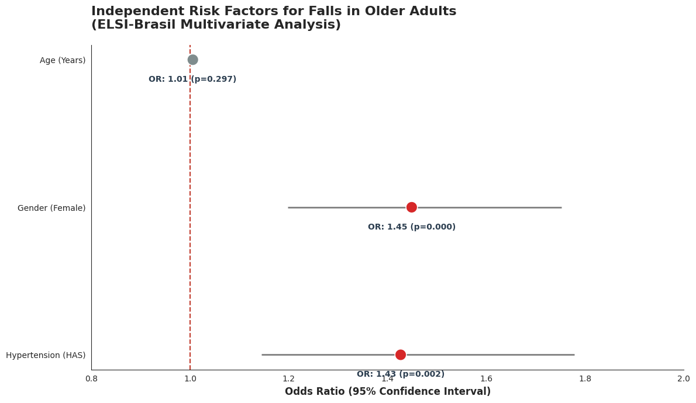

# Project: Fall Risk Factors in Older Adults - ELSI-Brasil Dataset

### 🩺 Clinical Data Science Project
As a Medical Student and Digital Health researcher, I developed this project to identify independent risk factors for falls in the elderly. Moving beyond simple correlation, this study employs Multivariate Logistic Regression to isolate the true impact of clinical comorbidities on geriatric stability.

## 📊 Key Findings (Results)
The model was statistically significant (p < 0.001) and revealed:
* **Hypertension (HAS):** An independent risk factor (OR: 1.43, p=0.002). Hypertensive patients have a 43% higher risk** of falling, regardless of age, ikely associated with polypharmacy or orthostatic dysregulation.
* **Gender:** Women are **45% more likely** to fall (OR: 1.45, p<0.001) compared to men in the same age group.
* **The Age Paradox:** Chronological age was **not** a significant predictor when adjusted for comorbidities (p=0.29), suggesting that biological health is a more reliable metric than birth year for this outcome.

## 🛠️ Tech Stack 
* **Language:** Python
* **Libraries:** `Pandas` (Data Wrangling), `Statsmodels` (Logistic Regression), `Seaborn/Matplotlib` (Academic DataViz).
* **Statistical Approach:** Adjusted Odds Ratio (OR) with 95% Confidence Intervals.
* **Source:** ELSI-Brasil (n=9,699).

## 📊 Data source and credits
This study uses data from ELSI-Brasil (English Longitudinal Study of Ageing).
The ELSI-Brasil is supported by the Brazilian Ministry of Health and the Ministry of Science, Technology, and Innovation.
Reference: Lima-Costa MF, et al. (2018). Rev Saude Publica.

